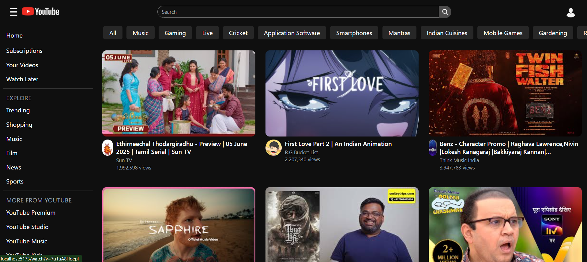
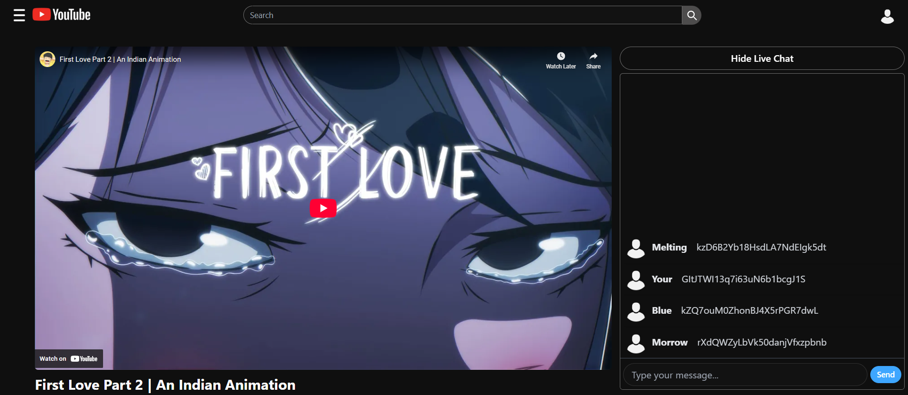
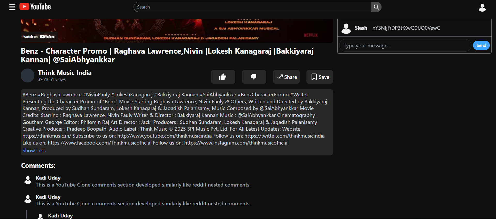

# 📺 YouTube Clone - `yt-clone`

A fully responsive YouTube clone application built using **React**, **Tailwind CSS**, **Redux Toolkit**, and **YouTube Data API v3**. This clone includes a dynamic homepage with trending videos, a search feature with live suggestions, a detailed watch page, and simulated live chat.

---

## 🚀 Features

- 🔥 **Trending Videos** – Fetched from YouTube Data API v3
- 🔍 **Live Search Suggestions** – Real-time search autocomplete
- 🎥 **Watch Page** – Video player with channel icon, title, views & description
- 💬 **Live Chat** – Simulated with auto-generated messages
- 🎨 **Responsive Design** – Mobile-first and optimized for all screen sizes
- 🧠 **Custom Hooks** – Clean state management and API fetching logic
- 📦 **Redux Toolkit** – Manages application-wide state
- 🌐 **Routing** – Page navigation using React Router DOM

---

## 📚 Learnings

- Deep understanding of **React functional components and hooks**
- Usage of **Redux Toolkit slices** to manage global state
- API integration with **YouTube Data API**
- Implementing **responsive layouts** with Tailwind
- Handling **conditional rendering and loading states**
- Experience working with **React Router for dynamic routes**
- Using **debounce techniques** for efficient input handling
- Structuring a **production-ready React app** using Parcel/Vite

---

## 🖼️ Screenshots

### 🏠 Home Page



### ▶️ Watch Page



### 💬 Comments Section



---

## 💻 Installation

### 1. Clone the repository:

```bash
git clone https://github.com/yourusername/netflix-gpt.git
cd netflix-gpt
```

### 2. Install dependencies:

```bash
npm install
```

### 3. Create a `.env` file:

```env

VITE_GOOGLE_API_KEY=your_key
```

### 4. Run the development server:

```bash
npm run start
```

---

## Important Note

To use this application, you need to have your own Google API Key. Make sure to set these keys in your environment variables or configuration files before running the app locally or deploying it. For better UI experience in Desktop or Laptop kepp your browse page at 67%.

---

## Live Demo

Check out the live demo of this project here:
[YouTube-Clone](https://youtube-yt-clone-react.netlify.app/)

---

## Contributing

Contributions are welcome! If you find any issues or have suggestions for improvements, please feel free to open an issue or submit a pull request.
